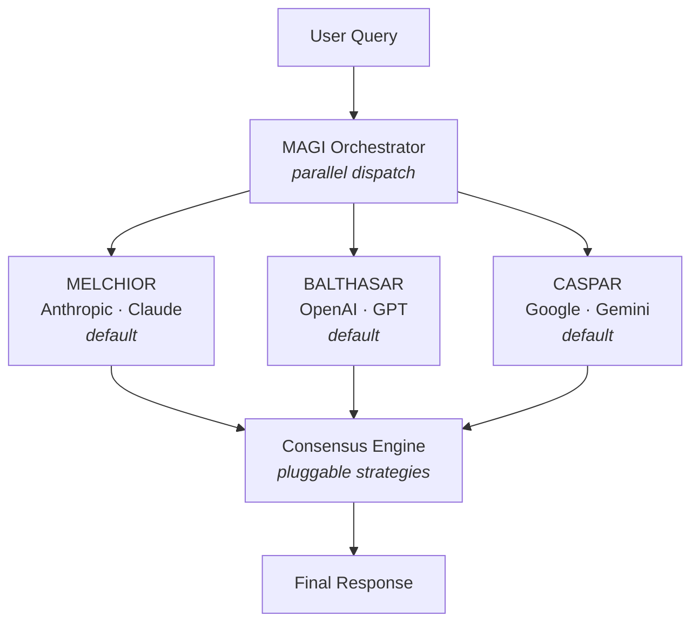

# MAGI

🔺🔻🔺

[](https://github.com/retrobit/magi/actions/workflows/ci.yml)
[](LICENSE)
[](https://kit.svelte.dev)
[](https://www.typescriptlang.org)

Three AI models. One consensus.

<p align="center">
  <a href="docs/media/magi-demo.mp4">
    
  </a>
</p>

Inspired by the MAGI system (IYKYK) concept — three independent supercomputers (MELCHIOR, BALTHASAR, CASPAR) that deliberate and reach consensus.

This project sends your query to three competing frontier AI models in parallel, then synthesizes their responses into a unified answer.

## 🤔 Why?

Any single LLM can hallucinate, hedge, or miss context. By querying three models from different providers and synthesizing their outputs, MAGI gives you:

- **Higher confidence** — Points where all three models agree are likely reliable.
- **Broader coverage** — Each model has different training data and reasoning patterns. Blind spots in one are often covered by another.
- **Built-in fact-checking** — Disagreements between models surface uncertainty that a single model would silently gloss over.
- **Provider independence** — If one provider has an outage, the other two still contribute.

## 🏗 Architecture



## ⚡ How It Works

1. **Parallel dispatch** — Your query is sent to all three models simultaneously via the Vercel AI SDK's `streamText()`. Total latency is determined by the slowest model, not the sum of all three.
2. **Independent responses** — Each model responds without knowledge of the others, ensuring genuinely independent perspectives. Model responses stream to the client in real time as they arrive.
3. **Consensus synthesis** — Once all three responses are in, the consensus engine streams a unified answer via `streamText()` that identifies agreements, resolves disagreements, and flags remaining uncertainty.
4. **Partial consensus** — If one or two models fail, the system proceeds with the available responses and warns the user that consensus is based on partial data.
5. **Multi-turn context** — On a follow-up query, each node replays only its _own_ prior turns (it never sees the other nodes or the consensus), and the consensus builds on prior consensuses. Token usage is tracked per node and against each model's context window.
6. **Prompt caching** — Because LLM APIs are stateless, every turn re-sends the whole replayed thread. An ephemeral Anthropic `cache_control` breakpoint marks that thread as a cacheable prefix, so Claude reads it back at ~10% of the input price on each follow-up instead of reprocessing it. OpenAI and Gemini 2.5 cache automatically; this closes the gap for Claude, which runs in the MELCHIOR seat on every paid tier.

## 🎨 UI Features

- **Multi-turn conversation** — Ask follow-ups; each panel keeps a scrollable per-turn transcript. Conversations persist per-tier in `localStorage` and survive reloads.
- **Live response progress** — While a query runs, the consensus panel shows a live "Waiting for MAGI — N / 3 responded…" count, with a "M failed" clause when nodes error out.
- **Token tracking** — Per-node input/output token counts, a cumulative conversation total, prompt-cache hits surfaced on hover, and a per-model context-window gauge that warns as a model nears its limit.
- **Pre-flight health checks** — Models are checked before dispatching. Unhealthy models show a clear error in their panel without burning tokens on any API call.
- **Per-tier model memory** — Custom node/model selections are saved per tier and restored on reload.
- **All UI settings persist** — Strategy, temperament toggles, custom temperament names and personas, generic labels, theme, background, color palette, motion mode, debate rounds, Opinionated/Collaborative toggles, layout focus mode, and auto-scroll mode all survive a reload via `localStorage`.
- **Provider budget readout** — The settings panel shows each paid provider's spend so far today. OpenRouter reads its key's usage/limit out of the box; Anthropic and OpenAI report today's cost from their organization Cost APIs when an admin key is configured (with optional `*_MONTHLY_BUDGET` env vars as a bar denominator); Google falls back to a clear "unavailable" message since AI Studio exposes no public per-key usage.
- **Syntax highlighting** — Fenced code blocks in model and consensus responses are highlighted, with a token palette that adapts to dark and light mode.
- **Auto-scroll modes** — Follow (default — pin to the newest streamed text while scrolled to the bottom; a manual scroll-up pauses it until you return to the bottom), Snap to top (jump each panel to the start of its latest response once that response finishes), or Off. Set in the ⚙️ settings menu under AUTO-SCROLL.
- **Background variants** — Off (default), cursor-reactive hex mesh, animated orbs, or RGB columns — chosen in the ⚙️ settings menu.
- **Motion modes** — Three modes in ⚙️ Settings: **Normal (default)** — holds the ambient background and cursor-spotlight still but keeps every other UI animation; **Full** — animates everything including the background; **Reduced** — stills all motion (also honored from the OS `prefers-reduced-motion` setting).
- **Dark / Light mode** — Toggle via the ⚙️ settings gear in the top-right header.
- **Example & random prompts** — On a fresh conversation the consensus panel offers example-prompt chips and a 🎲 dice button that _fill_ the input without submitting; Execute stays disabled until the input is non-empty. If a conversation is already underway, picking one first confirms before starting over.
- **Copy buttons** — One-click copy on each node response, the consensus, and the prompt input. Node copy is a split button with a scope menu (final response, query + final, or — for debate — final + rounds / everything).
- **Layout focus** — A segmented toggle in the conversation status bar (also reachable via panel-header clicks) controls which panels are expanded. The leading segment is **Auto** (🪄 wand icon, the default): while nodes are generating phase-1 answers the three node panels expand; the moment consensus starts streaming alongside still-working nodes (a debate's rounds) the view snaps to **Balanced** (nodes + consensus shared); it snaps to **Consensus**-expanded as soon as every MAGI is done — even while the consensus is still streaming — so you're not waiting on it to finish. Picking any manual segment (Balanced / Expand nodes / Expand consensus) disarms Auto and pins that choice; clicking Auto re-enables the follow behavior. The choice persists across reloads, but Auto stays disarmed on page load so a restored conversation doesn't yank the layout. Starting a **New conversation** while Auto is on resets the view to Balanced. The switch animates (respects reduced-motion). Nodes pulse while they're actively thinking each round.
- **Opinionated mode** — A toggle in the top control strip that pushes each model to commit to a single definitive answer on open-ended questions instead of hedging or listing options. Applies to all strategies (shapes phase-1 answers and the synthesizer).
- **Collaborative mode** — A toggle shown next to TEMPERAMENT when the Debate strategy is active. Pushes debaters to genuinely weigh each other's reasoning and lean toward convergence (without caving). Only meaningful for Multi-Round Debate.
- **Animated ASCII intro** — A full-screen splash plays on every page load. Only the `decode` concept (the MAGI wordmark resolving letter by letter from noise) is reachable in the UI; `boot` (node-by-node power-on sequence) and `convergence` (three labeled nodes beaming into the central ▲▼▲ mark) remain implemented in code and are previewable via the `?splash=<concept>` query param. Clicking the header MAGI mark replays the splash. Any key or click skips; `prefers-reduced-motion` jumps straight to the final frame.
- **Color palettes** — Five palettes selectable in ⚙️ Settings: **Nebula (default)** — vivid blue / purple / red node triad over a neutral background; **RGB** — red/green/blue node identity; **Red**, **Blue**, and **Green** — monochrome triads matching the RGB palette's respective shade.
- **Per-node retry** — An errored node surfaces a "Retry this node" button that re-runs only that node and re-synthesizes consensus — without re-billing the nodes that already responded. Implemented via `forceRetry`, `retryNodes`, and `priorResponses` API fields.
- **Per-turn peer-order randomization** — Voting jurors and debate peers see rivals anonymized as Candidate A/B. The seating is shuffled server-side each turn (seeded Fisher–Yates) so position bias washes out across runs; the stats panel measures the residual effect.
- **Stats panel** — Filterable run history: strategy and date-range chips (24 h / 7 d / 30 d), JSON export, and a confirm-guarded clear action.
- **Keyboard focus ring** — All interactive elements have a `:focus-visible` ring styled with the active theme's accent color.
- **Reset to defaults** — A danger-styled action at the bottom of the ⚙️ settings menu clears saved preferences, conversations, and run stats after a confirmation.
- **Responsive layout** — Panels stack vertically on narrow viewports with scrolling; desktop uses a fixed side-by-side layout.

## 🎭 Temperaments

Each MAGI node has an optional **temperament** — a dispositional lens that shapes how it approaches a query. When enabled, each node receives a system prompt that steers its reasoning style:

| Node      | Temperament      | Guiding question                 |
| --------- | ---------------- | -------------------------------- |
| MELCHIOR  | 🧊 Rationalist   | "What do the facts say?"         |
| BALTHASAR | 🛡️ Caretaker     | "Who does this affect, and how?" |
| CASPAR    | 🔥 Individualist | "What feels true?"               |

- **Rationalist** — Cold logic, empirical reasoning, data above all else.
- **Caretaker** — Empathy-first, weighs human cost, safety, and wellbeing.
- **Individualist** — Bold conviction, authenticity, the perspective no one else would give.

Temperaments are **off by default** and can be toggled via the 🧠 button in the UI header or the `temperaments: true` flag in the API request body. When disabled, all three nodes respond without any system prompt, giving raw model output.

Each seat's temperament **name and persona are editable** via the ✏️ pencil button next to the TEMPERAMENT toggle in the control strip. The editor lets you rename the seat and rewrite the full persona text. Leave a field blank to fall back to the built-in default; each seat also has a "Reset to \<default\>" action. Custom names show on the node panel's temperament badge; the hover tooltip shows the full custom persona. Customizations are stored sparsely in `localStorage` (only edited seats are saved) and are length-validated server-side.

> **Note:** For direct-API models (Anthropic, OpenAI, Google), temperaments are sent as a native `system` message. For OpenRouter models, the temperament is prepended to the user prompt instead — OpenRouter's free-tier models do not reliably support the `system` role, and their API provides no way to detect support per model.

### Consensus Temperament & Awareness

When temperaments are enabled, two additional controls appear in the consensus panel. Their effect depends on the active strategy:

- **Consensus Temperament** — **Synthesis only.** Gives the synthesizer the consensus node's lens (a Rationalist synthesis prioritizes logic; a Caretaker weighs human cost; an Individualist gives bold takes). For Structured Voting it's inert (greyed, with a tooltip): the winner is a tally of juror scores judged on substance, and a dispositional lens would only bias an otherwise objective vote.
- **Temperament awareness** — Tells the synthesizer that each response came from a different dispositional lens, so it can surface _why_ perspectives diverge. The prompt names the **actual** lens each node used this turn — its real label and persona, resolved from the live config — so it reflects the truth (including any custom personas) rather than a hard-coded or inferred guess. **Synthesis only** — for Voting this toggle is greyed (with a tooltip), since voting has no single narrator to be "aware."

Both are independent toggles and off by default. With **Structured Voting** selected, the Consensus Node dropdown is also greyed and the consensus-temperament badge next to the panel title is hidden — voting tallies all jurors equally and has no single consensus node.

## 🎚️ Model Tiers

Users can select a tier to control quality vs. cost:

| Tier         | Anthropic         | OpenAI       | Google                |
| ------------ | ----------------- | ------------ | --------------------- |
| **Frontier** | Claude Opus 4.7   | GPT-5.5      | Gemini 2.5 Pro        |
| **Balanced** | Claude Sonnet 4.6 | GPT-5.4      | Gemini 3.5 Flash      |
| **Budget**   | Claude Haiku 4.5  | GPT-5.4 Mini | Gemini 3.1 Flash Lite |

| Tier     | Source                                                                |
| -------- | --------------------------------------------------------------------- |
| **Free** | Dynamic — fetched from [OpenRouter](https://openrouter.ai) at runtime |

> The **Free** tier routes all three nodes through OpenRouter. Available models are fetched dynamically from the OpenRouter API, so the list always reflects what's currently live. Three models from different providers are auto-selected as defaults. Set `OPENROUTER_API_KEY` to enable it.

## 🧠 Consensus Strategies

The consensus engine is pluggable. Available strategies:

- **Synthesis** — A model reads all three responses, identifies where they agree and disagree, and combines the best elements into a single unified answer. The consensus model is configurable via the `consensusNode` request parameter (defaults to the first node, MELCHIOR).
- **Structured Voting** — Each responding node acts as a juror that scores its peers' answers (anonymized as Candidate A/B) from 0 to 10. The highest aggregate score wins, and that response becomes the consensus, shown with a tally table followed by the winning response **verbatim**. Voting therefore makes _no_ additional consensus-model call — only the three juror calls — so the Consensus Node dropdown shows "None" and is disabled. Juror calls use plain `generateText` + lenient score parsing, so voting works on every tier, including free OpenRouter models that don't support structured output. Temperament toggles have no effect here — the vote is judged purely on each answer's substance.
- **Multi-Round Debate** — Each node first stakes out an initial position, then reads anonymized peer responses and revises across one or more rounds before a final synthesis combines the converged positions. A **Rounds** picker (2–5, default 3) shown next to the Strategy selector sets the round ceiling; the debate still stops early on convergence. Each round is shown per node as a collapsible section, and a node's panel pulses while it's working that round.
- **None** — Skips the consensus phase entirely. The three model responses stream side by side with no synthesis step — for when you just want to compare them yourself. No consensus tokens are spent.

## 📋 Prerequisites

- [Bun](https://bun.sh) runtime
- API keys from:
  - [Anthropic](https://console.anthropic.com)
  - [OpenAI](https://platform.openai.com)
  - [Google AI Studio](https://aistudio.google.com)
  - [OpenRouter](https://openrouter.ai/keys) (for the free tier)

## 🛠 Setup

```bash
# Install dependencies
bun install

# Add your API keys
cp .env.local.example .env.local
# Edit .env.local with your keys
```

### Environment Variables

| Variable                       | Required   | Description                                                                                                                                                                                                                                                                                                                                                                 |
| ------------------------------ | ---------- | --------------------------------------------------------------------------------------------------------------------------------------------------------------------------------------------------------------------------------------------------------------------------------------------------------------------------------------------------------------------------- |
| `ANTHROPIC_API_KEY`            | Paid tiers | Anthropic API key for Claude models                                                                                                                                                                                                                                                                                                                                         |
| `OPENAI_API_KEY`               | Paid tiers | OpenAI API key for GPT models                                                                                                                                                                                                                                                                                                                                               |
| `GOOGLE_GENERATIVE_AI_API_KEY` | Paid tiers | Google AI Studio key for Gemini models                                                                                                                                                                                                                                                                                                                                      |
| `OPENROUTER_API_KEY`           | Free tier  | OpenRouter API key for free-tier models ([get one here](https://openrouter.ai/keys))                                                                                                                                                                                                                                                                                        |
| `MAGI_API_KEY`                 | No         | Set to require Bearer token auth on `/api/magi` and `/api/magi/budget`. Leave unset when using only the built-in UI                                                                                                                                                                                                                                                         |
| `ANTHROPIC_ADMIN_KEY`          | No         | Anthropic organization admin key (`sk-ant-admin-…`). When set, Budget readout pulls today's spend from `/v1/organizations/cost_report`. Unavailable for individual accounts — the section only appears once an organization is set up. Falls back to `ANTHROPIC_API_KEY` if no admin key is configured, but the regular key will be rejected with a 401 (surfaced verbatim) |
| `OPENAI_ADMIN_KEY`             | No         | OpenAI organization admin key (`sk-admin-…`) created at platform.openai.com → Admin keys. When set, Budget readout pulls today's spend from `/v1/organization/costs`                                                                                                                                                                                                        |
| `ANTHROPIC_MONTHLY_BUDGET`     | No         | USD decimal (e.g. `50`). Optional bar denominator for the Anthropic Budget row — the provider API doesn't expose a hard per-key limit                                                                                                                                                                                                                                       |
| `OPENAI_MONTHLY_BUDGET`        | No         | USD decimal. Same as `ANTHROPIC_MONTHLY_BUDGET` for OpenAI                                                                                                                                                                                                                                                                                                                  |
| `OPENROUTER_REFERER`           | No         | Overrides the `HTTP-Referer` header sent to OpenRouter for attribution on its dashboards. Defaults to `https://github.com/retrobit/magi`; set to your deployment URL on a fork so traffic isn't misattributed upstream                                                                                                                                                      |
| `OPENROUTER_TITLE`             | No         | Overrides the `X-Title` header sent to OpenRouter for attribution. Defaults to `MAGI`; set to your app's name on a fork                                                                                                                                                                                                                                                     |
| `MAGI_LOG_LEVEL`               | No         | One of `debug`, `info`, `warn`, `error`. Lines below the active level are dropped. Defaults to `debug` in dev and `info` in production. Invalid values silently fall back to the default                                                                                                                                                                                    |

### Development

```bash
bun run dev          # Start dev server
bun run build        # Production build
bun run preview      # Preview production build
bun run check        # Type-check the project
bun run test         # Run unit tests
bun run lint         # Check formatting + linting
bun run format       # Auto-format with Prettier
```

For manual UI testing, see [TESTING.md](TESTING.md).

In dev mode (`bun run dev`), a 🐞 button next to the settings gear opens a **dev-only debug panel** that injects synthetic error and context-limit UI states into the live turn — useful for exercising failure modes and near-full-context views without making a real model request. It also includes a **"View states catalog"** button that opens a dev-only catalog enumerating every status/result/progress indicator and banner, making it easy to eyeball transient states deterministically. The button is gated by `import.meta.env.DEV` and never renders in production builds.

## 🔌 API

A machine-readable description of every endpoint below lives in [openapi.yaml](openapi.yaml) (OpenAPI 3.1). Run `bunx @redocly/cli lint openapi.yaml` to validate it, or feed it to Swagger UI / Postman / your codegen of choice to auto-generate clients.

### `GET /api/magi/models`

Returns available models for a given tier. Paid tiers return from the static registry; the free tier fetches dynamically from OpenRouter.

**Query parameters:**

| Param  | Required | Values                                   |
| ------ | -------- | ---------------------------------------- |
| `tier` | Yes      | `frontier`, `balanced`, `budget`, `free` |

**Response:**

```json
{
	"models": [
		{
			"id": "qwen/qwen3-coder:free",
			"gateway": "openrouter",
			"provider": "qwen",
			"displayName": "Qwen3 Coder",
			"contextLength": 262144
		}
	]
}
```

### `GET /api/magi/budget`

Returns each paid provider's current spend and remaining credit, so the UI can render a per-provider readout. OpenRouter is reported live; the other providers degrade gracefully when their admin credentials aren't configured (Anthropic / OpenAI) or no public usage API exists (Google).

**Query parameters:**

| Param   | Required | Values                                  |
| ------- | -------- | --------------------------------------- |
| `force` | No       | `1` bypasses the 60-second server cache |

**Headers:** Same `Authorization: Bearer <MAGI_API_KEY>` as `POST /api/magi` when the key is set.

**Response:**

```json
{
	"providers": [
		{
			"provider": "openrouter",
			"status": "ok",
			"label": "Default",
			"usage": 7.2,
			"limit": 10,
			"remaining": 2.8,
			"isFreeKey": false
		},
		{
			"provider": "anthropic",
			"status": "unavailable",
			"reason": "ANTHROPIC_ADMIN_KEY not configured"
		}
	]
}
```

Each entry's `status` is `ok`, `unavailable`, or `error`. Server-side results are cached for 60 seconds.

### `POST /api/magi`

The endpoint uses Server-Sent Events (SSE) to stream results as they arrive.

**Headers:**

```
Content-Type: application/json
Authorization: Bearer <MAGI_API_KEY>   # only if MAGI_API_KEY is set
```

**Request body:**

```json
{
	"query": "Your question here",
	"tier": "free",
	"strategy": "synthesis",
	"consensusNode": "MELCHIOR",
	"assignments": [
		{
			"node": "MELCHIOR",
			"gateway": "openrouter",
			"provider": "qwen",
			"modelId": "qwen/qwen3-coder:free"
		},
		{
			"node": "BALTHASAR",
			"gateway": "openrouter",
			"provider": "nvidia",
			"modelId": "nvidia/nemotron-3-super-120b-a12b:free"
		},
		{
			"node": "CASPAR",
			"gateway": "openrouter",
			"provider": "meta-llama",
			"modelId": "meta-llama/llama-3.3-70b-instruct:free"
		}
	]
}
```

| Field                  | Type    | Required | Values                                                                                                                                                                                                                                                                                                                                         |
| ---------------------- | ------- | -------- | ---------------------------------------------------------------------------------------------------------------------------------------------------------------------------------------------------------------------------------------------------------------------------------------------------------------------------------------------- |
| `query`                | string  | Yes      | 1–10,000 characters                                                                                                                                                                                                                                                                                                                            |
| `tier`                 | string  | Yes      | `frontier`, `balanced`, `budget`, `free`                                                                                                                                                                                                                                                                                                       |
| `strategy`             | string  | Yes      | `none`, `synthesis`, `voting`, or `debate`                                                                                                                                                                                                                                                                                                     |
| `consensusNode`        | string  | No       | `MELCHIOR`, `BALTHASAR`, or `CASPAR` (defaults to `MELCHIOR`)                                                                                                                                                                                                                                                                                  |
| `assignments`          | array   | No       | Tuple of 3 `NodeAssignment` objects. If omitted, uses the tier preset. Each must reference a valid model in the requested tier.                                                                                                                                                                                                                |
| `temperaments`         | boolean | No       | Enable dispositional temperaments (Rationalist, Caretaker, Individualist) for each node. Defaults to `false`.                                                                                                                                                                                                                                  |
| `consensusTemperament` | boolean | No       | Give the consensus synthesizer its own dispositional lens (based on `consensusNode`). Defaults to `false`.                                                                                                                                                                                                                                     |
| `temperamentAwareness` | boolean | No       | Tell the synthesizer that each response came from a distinct dispositional lens so it can surface _why_ they diverge. The prompt names the actual lens each node used this turn (real label + persona, resolved from `customTemperaments` when set), so it reflects the truth rather than a hard-coded or inferred guess. Defaults to `false`. |
| `genericLabels`        | boolean | No       | Use generic labels (MAGI 1/2/3) in consensus prompts instead of proper names (MELCHIOR/BALTHASAR/CASPAR). Defaults to `true`.                                                                                                                                                                                                                  |
| `history`              | array   | No       | Prior conversation turns for multi-turn context. Each turn: `{ query, nodeResponses: [{ node, text }], consensus }`. Max 50.                                                                                                                                                                                                                   |
| `forceRetry`           | boolean | No       | Bypass and clear the unhealthy-model cache for every model in the request — forces a real re-call rather than bouncing off a stale health entry.                                                                                                                                                                                               |
| `retryNodes`           | array   | No       | Per-node retry: restrict phase-1 dispatch to these node names (max 3), clearing their health cache. Pass the still-good answers in `priorResponses`.                                                                                                                                                                                           |
| `priorResponses`       | array   | No       | Per-node retry: the already-good answers for nodes NOT being retried — `[{ node, text }]`, max 3. Gateway/provider are resolved server-side.                                                                                                                                                                                                   |
| `debateRounds`         | number  | No       | Multi-Round Debate round ceiling, 2–5. Out-of-range values are clamped. Absent ⇒ default 3.                                                                                                                                                                                                                                                    |
| `opinionated`          | boolean | No       | Push each model to commit to a single definitive answer on open-ended questions instead of hedging. Applies to all strategies. Defaults to `false`.                                                                                                                                                                                            |
| `collaborative`        | boolean | No       | Push debaters to weigh each other's reasoning and lean toward convergence. Meaningful for Multi-Round Debate only. Defaults to `false`.                                                                                                                                                                                                        |

**SSE events:**

| Event                | Payload                                                  | Description                        |
| -------------------- | -------------------------------------------------------- | ---------------------------------- |
| `config`             | `NodeAssignment[]`                                       | Node-to-model assignment mapping   |
| `model-chunk`        | `{ node, text }`                                         | Streaming text delta from a node   |
| `model-response`     | `{ node, gateway, provider, text }`                      | Individual model complete response |
| `model-error`        | `{ node, gateway, provider, error }`                     | Individual model failure           |
| `model-usage`        | `{ node, inputTokens, outputTokens, cachedInputTokens }` | Token usage for a completed node   |
| `partial-consensus`  | `{ responded, total }`                                   | Warning: not all models responded  |
| `consensus-chunk`    | `{ text }`                                               | Streaming consensus text delta     |
| `consensus-complete` | `{ text }`                                               | Full consensus text                |
| `consensus-usage`    | `{ inputTokens, outputTokens, cachedInputTokens }`       | Token usage for the consensus      |
| `error`              | `{ message }`                                            | Fatal error                        |

**Rate limiting:** 10 requests per minute per IP. The limiter is in-memory and keyed by `getClientAddress()`, so multi-instance deployments multiply the effective limit; configure a trusted proxy / `ADDRESS_HEADER` so the server sees real client IPs.

**Error responses:**

| Status | Meaning                    |
| ------ | -------------------------- |
| `400`  | Invalid JSON or request    |
| `401`  | Invalid or missing API key |
| `415`  | Wrong Content-Type         |
| `429`  | Rate limit exceeded        |

### SSE Client Example

```ts
const res = await fetch('/api/magi', {
	method: 'POST',
	headers: { 'Content-Type': 'application/json' },
	body: JSON.stringify({ query: 'What is consciousness?', tier: 'free', strategy: 'synthesis' })
});

const reader = res.body!.getReader();
const decoder = new TextDecoder();
let buffer = '';

while (true) {
	const { done, value } = await reader.read();
	if (done) break;

	buffer += decoder.decode(value, { stream: true });
	const parts = buffer.split('\n\n');
	buffer = parts.pop() ?? '';

	for (const part of parts) {
		const event = part.match(/^event: (.+)$/m)?.[1];
		const data = part.match(/^data: (.+)$/m)?.[1];
		if (event && data) {
			console.log(event, JSON.parse(data));
		}
	}
}
```

## 📁 Project Structure

```
src/
├── routes/
│   ├── +page.svelte                # Main UI
│   ├── +layout.svelte              # Root layout
│   ├── layout.css                  # Global styles (Tailwind)
│   └── api/magi/
│       ├── +server.ts              # SSE orchestration endpoint
│       ├── route.test.ts
│       ├── models/
│       │   ├── +server.ts          # Model discovery endpoint
│       │   └── route.test.ts
│       └── budget/
│           ├── +server.ts          # Provider budget readout endpoint
│           └── route.test.ts
├── lib/
│   ├── index.ts                    # Barrel exports
│   ├── server/
│   │   ├── rate-limit.ts           # Per-IP sliding window rate limiter
│   │   ├── rate-limit.test.ts
│   │   ├── health.ts               # Model health tracking
│   │   ├── health.test.ts
│   │   ├── logger.ts               # Structured logging + latency timers
│   │   ├── logger.test.ts
│   │   ├── openrouter.ts           # Dynamic model discovery from OpenRouter API
│   │   ├── openrouter.test.ts
│   │   ├── auth.ts                 # Shared MAGI_API_KEY bearer-token check
│   │   ├── auth.test.ts
│   │   ├── budget.ts               # Per-provider spend/limit aggregator (60s cache)
│   │   └── budget.test.ts
│   ├── magi/
│   │   ├── types.ts                # Core types (nodes, tiers, providers, temperaments)
│   │   ├── types.test.ts
│   │   ├── config.ts               # Node-to-provider assignment + validation
│   │   ├── config.test.ts
│   │   ├── models.ts               # AI SDK client factory
│   │   ├── models.test.ts
│   │   ├── registry.ts             # Model ID registry (provider × tier)
│   │   ├── registry.test.ts
│   │   ├── temperaments.ts         # Temperament system prompts
│   │   ├── temperaments.test.ts
│   │   ├── validation.ts           # Zod request schema
│   │   ├── validation.test.ts
│   │   ├── persistence.ts          # localStorage — per-tier assignments + global UI settings + conversations
│   │   ├── persistence.test.ts
│   │   ├── stream-events.ts        # Typed SSE event map (server + client)
│   │   ├── stream-events.test.ts
│   │   ├── prompt-cache.ts         # Anthropic prompt-cache breakpoint helper
│   │   ├── prompt-cache.test.ts
│   │   └── consensus/
│   │       ├── types.ts            # ConsensusStrategy interface + strategy labels
│   │       ├── synthesis.ts        # Synthesis strategy
│   │       ├── synthesis.test.ts
│   │       ├── voting.ts           # Structured Voting strategy
│   │       ├── voting.test.ts
│   │       ├── debate.ts           # Multi-Round Debate strategy
│   │       ├── debate.test.ts
│   │       ├── peer-order.ts       # Per-turn seeded peer-order shuffle (Fisher–Yates)
│   │       ├── peer-order.test.ts
│   │       ├── consensus.test.ts
│   │       └── index.ts            # Strategy registry
│   └── components/
│       ├── ConfirmModal.svelte     # Confirm-guarded action dialog
│       ├── ConsensusView.svelte    # Consensus display with copy
│       ├── CopyScopeButton.svelte  # Split copy button with scope dropdown
│       ├── DebugPanel.svelte       # Dev-only panel (gated by import.meta.env.DEV)
│       ├── DebugPanel.svelte.test.ts
│       ├── LayoutToggle.svelte     # Balanced / node-heavy / consensus-heavy layout cycler
│       ├── MagiBackground.svelte   # Animated background
│       ├── MagiHeader.svelte       # Top header bar with nav and controls
│       ├── MagiPanel.svelte        # Individual model response panel
│       ├── Markdown.svelte         # Sanitized, syntax-highlighted markdown renderer
│       ├── BudgetReadout.svelte    # Per-provider spend readout in the settings panel
│       ├── PerfOverlay.svelte      # Dev-only FPS / long-task performance overlay
│       ├── Splash.svelte           # Animated ASCII intro (boot / decode / convergence)
│       ├── StatsPanel.svelte       # Filterable run-history stats with JSON export
│       ├── StrategyPicker.svelte   # Consensus strategy selector with smart-flip
│       ├── TokenCount.svelte       # Compact ↑/↓/⚡ token-count formatter
│       ├── TokenCount.svelte.test.ts
│       ├── TierSelector.svelte     # Tier toggle
│       └── TierSelector.svelte.test.ts
└── vitest-setup-client.ts          # jest-dom matchers for the jsdom test project
```

## 🧰 Stack

- **Runtime**: Bun
- **Language**: TypeScript
- **Framework**: SvelteKit
- **AI SDK**: Vercel AI SDK
- **Styling**: Tailwind CSS
- **Validation**: Zod
- **Display/title font**: Michroma — used for the MAGI marks and headings
- **Body/reply font**: Atkinson Hyperlegible — used for model and consensus response text

## 🔐 Security

- **Authentication** — Optional Bearer token auth via `MAGI_API_KEY`. When unset, the endpoint relies on SvelteKit's built-in CSRF protection (same-origin only).
- **Rate limiting** — Sliding-window IP rate limiter (10 req/min) with automatic stale-entry cleanup.
- **Input validation** — All requests validated through Zod schemas with strict type, length, and enum constraints.
- **Content-Type enforcement** — Rejects requests without `application/json`.
- **Timing-safe comparison** — API key checks use `crypto.timingSafeEqual` to prevent timing attacks.
- **Abort propagation** — Client disconnects cancel in-flight LLM calls to avoid wasting tokens.
- **No internal leakage** — Server errors are logged server-side; clients receive generic messages.

## 🚀 Deployment

MAGI uses [`adapter-auto`](https://svelte.dev/docs/kit/adapter-auto), which auto-detects your deployment target. Works out of the box on:

- [Vercel](https://vercel.com)
- [Netlify](https://netlify.com)
- [Cloudflare Pages](https://pages.cloudflare.com)

For other environments, swap the adapter in `svelte.config.js`. See [SvelteKit adapters](https://svelte.dev/docs/kit/adapters).

```bash
bun run build
```

Make sure your production environment has all required environment variables set.

> **Note:** The in-memory rate limiter resets on deploy/restart. For production at scale, consider replacing it with a Redis-backed solution.

> **Logs:** Request logs are structured — readable `key=value` lines in development, one JSON object per line in production — so a log collector can parse per-model latency (time-to-first-token, total duration) and token metrics.

## 🗺️ Roadmap

See [ROADMAP.md](ROADMAP.md) for planned features and improvements.

## 📄 License

MIT
