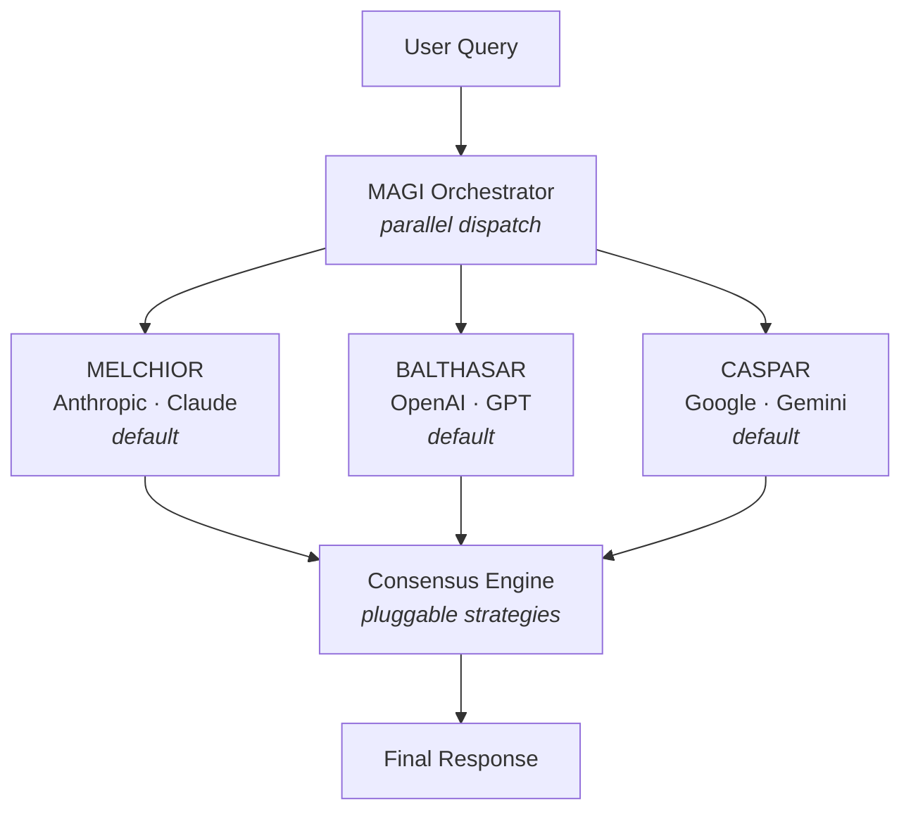

# MAGI

🔺🔻🔺

Three AI models. One consensus.

Inspired by the MAGI system (IYKYK) concept — three independent supercomputers (MELCHIOR, BALTHASAR, CASPAR) that deliberate and reach consensus.

This project sends your query to three competing frontier AI models in parallel, then synthesizes their responses into a unified answer.

## 🤔 Why?

Any single LLM can hallucinate, hedge, or miss context. By querying three models from different providers and synthesizing their outputs, MAGI gives you:

- **Higher confidence** — Points where all three models agree are likely reliable.
- **Broader coverage** — Each model has different training data and reasoning patterns. Blind spots in one are often covered by another.
- **Built-in fact-checking** — Disagreements between models surface uncertainty that a single model would silently gloss over.
- **Provider independence** — If one provider has an outage, the other two still contribute.

## 🏗 Architecture



## ⚡ How It Works

1. **Parallel dispatch** — Your query is sent to all three models simultaneously via the Vercel AI SDK's `streamText()`. Total latency is determined by the slowest model, not the sum of all three.
2. **Independent responses** — Each model responds without knowledge of the others, ensuring genuinely independent perspectives. Model responses stream to the client in real time as they arrive.
3. **Consensus synthesis** — Once all three responses are in, the consensus engine streams a unified answer via `streamText()` that identifies agreements, resolves disagreements, and flags remaining uncertainty.
4. **Partial consensus** — If one or two models fail, the system proceeds with the available responses and warns the user that consensus is based on partial data.

## 🎚️ Model Tiers

Users can select a tier to control quality vs. cost:

| Tier         | Anthropic         | OpenAI       | Google         |
| ------------ | ----------------- | ------------ | -------------- |
| **Frontier** | Claude Opus 4.6   | GPT-5.2      | Gemini 3.1 Pro |
| **Balanced** | Claude Sonnet 4.6 | GPT-4o       | Gemini 3 Flash |
| **Budget**   | Claude Haiku 4.5  | GPT-4.1 mini | Gemini 3 Flash |

| Tier     | OpenRouter            | OpenRouter               | OpenRouter            |
| -------- | --------------------- | ------------------------ | --------------------- |
| **Free** | Step 3.5 Flash (StepFun) | Nemotron 3 Super (NVIDIA) | Trinity Large (Arcee AI) |

> The **Free** tier routes all three nodes through [OpenRouter](https://openrouter.ai) using diverse free models. Set `OPENROUTER_API_KEY` to enable it.

## 🧠 Consensus Strategies

The consensus engine is pluggable. Available strategies:

- **Synthesis** — A model reads all three responses, identifies where they agree and disagree, and combines the best elements into a single unified answer. The consensus model is configurable via the `consensusNode` request parameter (defaults to the first node, MELCHIOR).

Future strategies (planned):

- **Structured Voting** — Each model scores the other two responses; majority wins.
- **Multi-Round Debate** — Models critique each other's answers iteratively until convergence.

## 📋 Prerequisites

- [Bun](https://bun.sh) runtime
- API keys from:
  - [Anthropic](https://console.anthropic.com)
  - [OpenAI](https://platform.openai.com)
  - [Google AI Studio](https://aistudio.google.com)
  - [OpenRouter](https://openrouter.ai/keys) (for the free tier)

## 🛠 Setup

```bash
# Install dependencies
bun install

# Add your API keys
cp .env.local.example .env.local
# Edit .env.local with your keys
```

### Environment Variables

| Variable                       | Required | Description                                                                                  |
| ------------------------------ | -------- | -------------------------------------------------------------------------------------------- |
| `ANTHROPIC_API_KEY`            | Yes      | Anthropic API key for Claude models                                                          |
| `OPENAI_API_KEY`               | Yes      | OpenAI API key for GPT models                                                                |
| `GOOGLE_GENERATIVE_AI_API_KEY` | Yes      | Google AI Studio key for Gemini models                                                       |
| `OPENROUTER_API_KEY`           | Free tier| OpenRouter API key for free-tier models ([get one here](https://openrouter.ai/keys))         |
| `MAGI_API_KEY`                 | No       | Set to require Bearer token auth on `/api/magi`. Leave unset when using only the built-in UI |

### Development

```bash
bun run dev          # Start dev server
bun run build        # Production build
bun run preview      # Preview production build
bun run check        # Type-check the project
bun run test         # Run unit tests
bun run lint         # Check formatting + linting
bun run format       # Auto-format with Prettier
```

## 🔌 API

### `POST /api/magi`

The endpoint uses Server-Sent Events (SSE) to stream results as they arrive.

**Headers:**

```
Content-Type: application/json
Authorization: Bearer <MAGI_API_KEY>   # only if MAGI_API_KEY is set
```

**Request body:**

```json
{
  "query": "Your question here",
  "tier": "free",
  "strategy": "synthesis",
  "consensusNode": "MELCHIOR",
  "assignments": [
    { "node": "MELCHIOR", "gateway": "openrouter", "provider": "stepfun", "modelId": "stepfun/step-3.5-flash:free" },
    { "node": "BALTHASAR", "gateway": "openrouter", "provider": "nvidia", "modelId": "nvidia/nemotron-3-super-120b-a12b:free" },
    { "node": "CASPAR", "gateway": "openrouter", "provider": "arcee-ai", "modelId": "arcee-ai/trinity-large-preview:free" }
  ]
}
```

| Field               | Type   | Required | Values                                  |
| ------------------- | ------ | -------- | --------------------------------------- |
| `query`             | string | Yes      | 1–10,000 characters                     |
| `tier`              | string | Yes      | `frontier`, `balanced`, `budget`, `free`|
| `strategy`          | string | Yes      | `synthesis`                             |
| `consensusNode`     | string | No       | `MELCHIOR`, `BALTHASAR`, or `CASPAR` (defaults to `MELCHIOR`) |
| `assignments`       | array  | No       | Tuple of 3 `NodeAssignment` objects. If omitted, uses the tier preset. Each must reference a valid model in the requested tier. |

**SSE events:**

| Event                | Payload                                          | Description                          |
| -------------------- | ------------------------------------------------ | ------------------------------------ |
| `config`             | `NodeAssignment[]`                               | Node-to-model assignment mapping      |
| `model-response`     | `{ node, gateway, provider, text }`              | Individual model response             |
| `model-error`        | `{ node, gateway, provider, error }`             | Individual model failure              |
| `partial-consensus`  | `{ responded, total }`                           | Warning: not all models responded     |
| `consensus-chunk`    | `{ text }`                                       | Streaming consensus text delta        |
| `consensus-complete` | `{ text }`                                       | Full consensus text                   |
| `error`              | `{ message }`                                    | Fatal error                           |

**Rate limiting:** 10 requests per minute per IP.

**Error responses:**

| Status | Meaning                   |
| ------ | ------------------------- |
| `400`  | Invalid JSON or request   |
| `401`  | Invalid or missing API key |
| `415`  | Wrong Content-Type         |
| `429`  | Rate limit exceeded        |

### SSE Client Example

```ts
const res = await fetch('/api/magi', {
  method: 'POST',
  headers: { 'Content-Type': 'application/json' },
  body: JSON.stringify({ query: 'What is consciousness?', tier: 'free', strategy: 'synthesis' })
});

const reader = res.body!.getReader();
const decoder = new TextDecoder();
let buffer = '';

while (true) {
  const { done, value } = await reader.read();
  if (done) break;

  buffer += decoder.decode(value, { stream: true });
  const parts = buffer.split('\n\n');
  buffer = parts.pop() ?? '';

  for (const part of parts) {
    const event = part.match(/^event: (.+)$/m)?.[1];
    const data = part.match(/^data: (.+)$/m)?.[1];
    if (event && data) {
      console.log(event, JSON.parse(data));
    }
  }
}
```

## 📁 Project Structure

```
src/
├── routes/
│   ├── +page.svelte                # Main UI
│   ├── +layout.svelte              # Root layout
│   └── api/magi/
│       └── +server.ts              # SSE orchestration endpoint
├── lib/
│   ├── index.ts                    # Barrel exports
│   ├── server/
│   │   └── rate-limit.ts           # Per-IP sliding window rate limiter
│   ├── magi/
│   │   ├── types.ts                # Core types (nodes, tiers, providers)
│   │   ├── config.ts               # Node-to-provider assignment + validation
│   │   ├── models.ts               # AI SDK client factory
│   │   ├── registry.ts             # Model ID registry (provider × tier)
│   │   ├── validation.ts           # Zod request schema
│   │   └── consensus/
│   │       ├── types.ts            # ConsensusStrategy interface
│   │       ├── synthesis.ts        # Synthesis strategy
│   │       └── index.ts            # Strategy registry
│   └── components/
│       ├── MagiPanel.svelte        # Individual model response panel
│       ├── TierSelector.svelte     # Tier toggle
│       ├── StrategySelector.svelte # Consensus strategy toggle
│       └── ConsensusView.svelte    # Consensus display with copy
```

## 🧰 Stack

- **Runtime**: Bun
- **Language**: TypeScript
- **Framework**: SvelteKit
- **AI SDK**: Vercel AI SDK
- **Styling**: Tailwind CSS
- **Validation**: Zod

## 🔐 Security

- **Authentication** — Optional Bearer token auth via `MAGI_API_KEY`. When unset, the endpoint relies on SvelteKit's built-in CSRF protection (same-origin only).
- **Rate limiting** — Sliding-window IP rate limiter (10 req/min) with automatic stale-entry cleanup.
- **Input validation** — All requests validated through Zod schemas with strict type, length, and enum constraints.
- **Content-Type enforcement** — Rejects requests without `application/json`.
- **Timing-safe comparison** — API key checks use `crypto.timingSafeEqual` to prevent timing attacks.
- **Abort propagation** — Client disconnects cancel in-flight LLM calls to avoid wasting tokens.
- **No internal leakage** — Server errors are logged server-side; clients receive generic messages.

## 🚀 Deployment

MAGI uses [`adapter-auto`](https://svelte.dev/docs/kit/adapter-auto), which auto-detects your deployment target. Works out of the box on:

- [Vercel](https://vercel.com)
- [Netlify](https://netlify.com)
- [Cloudflare Pages](https://pages.cloudflare.com)

For other environments, swap the adapter in `svelte.config.js`. See [SvelteKit adapters](https://svelte.dev/docs/kit/adapters).

```bash
bun run build
```

Make sure your production environment has all required environment variables set.

> **Note:** The in-memory rate limiter resets on deploy/restart. For production at scale, consider replacing it with a Redis-backed solution.

## 📄 License

MIT
