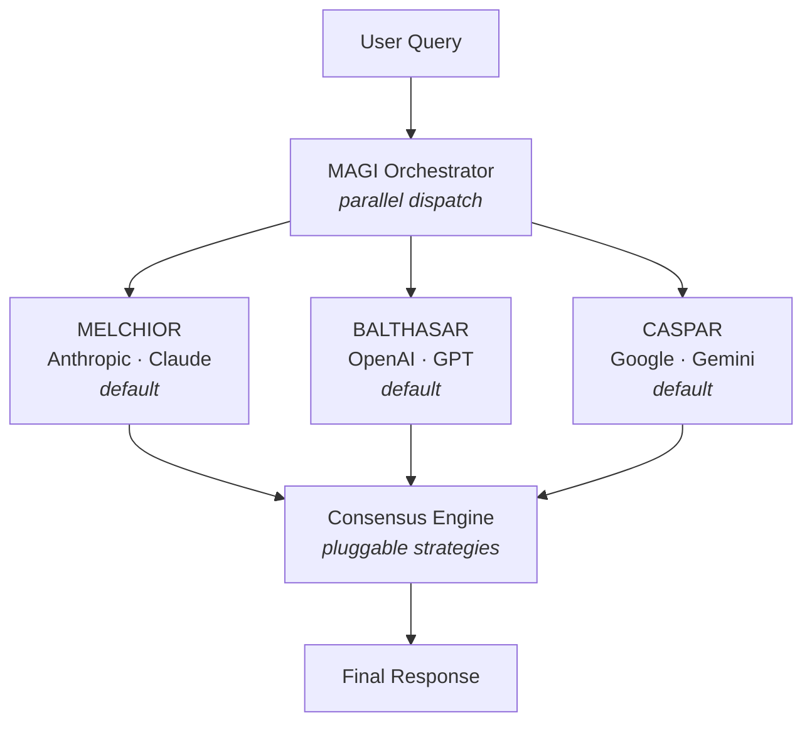

# MAGI

🔺🔻🔺

Three AI models. One consensus.

Inspired by the MAGI system (IYKYK) concept — three independent supercomputers (MELCHIOR, BALTHASAR, CASPAR) that deliberate and reach consensus.

This project sends your query to three competing frontier AI models in parallel, then synthesizes their responses into a unified answer.

## 🤔 Why?

Any single LLM can hallucinate, hedge, or miss context. By querying three models from different providers and synthesizing their outputs, MAGI gives you:

- **Higher confidence** — Points where all three models agree are likely reliable.
- **Broader coverage** — Each model has different training data and reasoning patterns. Blind spots in one are often covered by another.
- **Built-in fact-checking** — Disagreements between models surface uncertainty that a single model would silently gloss over.
- **Provider independence** — If one provider has an outage, the other two still contribute.

## 🏗 Architecture



## ⚡ How It Works

1. **Parallel dispatch** — Your query is sent to all three models simultaneously via the Vercel AI SDK's `streamText()`. Total latency is determined by the slowest model, not the sum of all three.
2. **Independent responses** — Each model responds without knowledge of the others, ensuring genuinely independent perspectives. Model responses stream to the client in real time as they arrive.
3. **Consensus synthesis** — Once all three responses are in, the consensus engine streams a unified answer via `streamText()` that identifies agreements, resolves disagreements, and flags remaining uncertainty.
4. **Partial consensus** — If one or two models fail, the system proceeds with the available responses and warns the user that consensus is based on partial data.
5. **Multi-turn context** — On a follow-up query, each node replays only its _own_ prior turns (it never sees the other nodes or the consensus), and the consensus builds on prior consensuses. Token usage is tracked per node and against each model's context window.
6. **Prompt caching** — Because LLM APIs are stateless, every turn re-sends the whole replayed thread. An ephemeral Anthropic `cache_control` breakpoint marks that thread as a cacheable prefix, so Claude reads it back at ~10% of the input price on each follow-up instead of reprocessing it. OpenAI and Gemini 2.5 cache automatically; this closes the gap for Claude, which runs in the MELCHIOR seat on every paid tier.

## 🎨 UI Features

- **Multi-turn conversation** — Ask follow-ups; each panel keeps a scrollable per-turn transcript. Conversations persist per-tier in `localStorage` and survive reloads.
- **Token tracking** — Per-node input/output token counts, a cumulative conversation total, prompt-cache hits surfaced on hover, and a per-model context-window gauge that warns as a model nears its limit.
- **Pre-flight health checks** — Models are checked before dispatching. Unhealthy models show a clear error in their panel without burning tokens on any API call.
- **Per-tier model memory** — Custom node/model selections are saved per tier and restored on reload.
- **Syntax highlighting** — Fenced code blocks in model and consensus responses are highlighted, with a token palette that adapts to dark and light mode.
- **Streaming auto-scroll** — Panels follow the latest streamed text while you're pinned to the bottom; scrolling up pauses the follow until you return. Toggleable in settings.
- **Background variants** — Animated RGB columns, orbs, or off (settings menu).
- **Dark / Light mode** — Toggle via the ⚙️ settings gear in the top-right header.
- **Random prompts** — Click Execute with an empty input to submit a random thought-provoking question.
- **Copy buttons** — One-click copy on each node response, the consensus, and the prompt input.
- **Responsive layout** — Panels stack vertically on narrow viewports with scrolling; desktop uses a fixed side-by-side layout.

## 🎭 Temperaments

Each MAGI node has an optional **temperament** — a dispositional lens that shapes how it approaches a query. When enabled, each node receives a system prompt that steers its reasoning style:

| Node      | Temperament      | Guiding question                 |
| --------- | ---------------- | -------------------------------- |
| MELCHIOR  | 🧊 Rationalist   | "What do the facts say?"         |
| BALTHASAR | 🛡️ Caretaker     | "Who does this affect, and how?" |
| CASPAR    | 🔥 Individualist | "What feels true?"               |

- **Rationalist** — Cold logic, empirical reasoning, data above all else.
- **Caretaker** — Empathy-first, weighs human cost, safety, and wellbeing.
- **Individualist** — Bold conviction, authenticity, the perspective no one else would give.

Temperaments are **off by default** and can be toggled via the 🧠 button in the UI header or the `temperaments: true` flag in the API request body. When disabled, all three nodes respond without any system prompt, giving raw model output.

> **Note:** For direct-API models (Anthropic, OpenAI, Google), temperaments are sent as a native `system` message. For OpenRouter models, the temperament is prepended to the user prompt instead — OpenRouter's free-tier models do not reliably support the `system` role, and their API provides no way to detect support per model.

### Consensus Temperament & Awareness

When temperaments are enabled, two additional controls appear in the consensus panel:

- **Temperament** — Gives the synthesis model its own dispositional lens (based on the selected consensus node). A Rationalist synthesizer prioritizes logic; a Caretaker weighs human cost; an Individualist gives bold takes.
- **Temperament awareness** — Tells the synthesizer that each response came from a different lens, so it can surface _why_ perspectives diverge rather than just noting disagreements.

Both are independent toggles and off by default.

## 🎚️ Model Tiers

Users can select a tier to control quality vs. cost:

| Tier         | Anthropic         | OpenAI       | Google                |
| ------------ | ----------------- | ------------ | --------------------- |
| **Frontier** | Claude Opus 4.7   | GPT-5.2      | Gemini 2.5 Pro        |
| **Balanced** | Claude Sonnet 4.6 | GPT-4o       | Gemini 2.5 Flash      |
| **Budget**   | Claude Haiku 4.5  | GPT-4.1 mini | Gemini 2.5 Flash Lite |

| Tier     | Source                                                                |
| -------- | --------------------------------------------------------------------- |
| **Free** | Dynamic — fetched from [OpenRouter](https://openrouter.ai) at runtime |

> The **Free** tier routes all three nodes through OpenRouter. Available models are fetched dynamically from the OpenRouter API, so the list always reflects what's currently live. Three models from different providers are auto-selected as defaults. Set `OPENROUTER_API_KEY` to enable it.

## 🧠 Consensus Strategies

The consensus engine is pluggable. Available strategies:

- **Synthesis** — A model reads all three responses, identifies where they agree and disagree, and combines the best elements into a single unified answer. The consensus model is configurable via the `consensusNode` request parameter (defaults to the first node, MELCHIOR).

Future strategies (planned):

- **Structured Voting** — Each model scores the other two responses; majority wins.
- **Multi-Round Debate** — Models critique each other's answers iteratively until convergence.

## 📋 Prerequisites

- [Bun](https://bun.sh) runtime
- API keys from:
  - [Anthropic](https://console.anthropic.com)
  - [OpenAI](https://platform.openai.com)
  - [Google AI Studio](https://aistudio.google.com)
  - [OpenRouter](https://openrouter.ai/keys) (for the free tier)

## 🛠 Setup

```bash
# Install dependencies
bun install

# Add your API keys
cp .env.local.example .env.local
# Edit .env.local with your keys
```

### Environment Variables

| Variable                       | Required   | Description                                                                                  |
| ------------------------------ | ---------- | -------------------------------------------------------------------------------------------- |
| `ANTHROPIC_API_KEY`            | Paid tiers | Anthropic API key for Claude models                                                          |
| `OPENAI_API_KEY`               | Paid tiers | OpenAI API key for GPT models                                                                |
| `GOOGLE_GENERATIVE_AI_API_KEY` | Paid tiers | Google AI Studio key for Gemini models                                                       |
| `OPENROUTER_API_KEY`           | Free tier  | OpenRouter API key for free-tier models ([get one here](https://openrouter.ai/keys))         |
| `MAGI_API_KEY`                 | No         | Set to require Bearer token auth on `/api/magi`. Leave unset when using only the built-in UI |

### Development

```bash
bun run dev          # Start dev server
bun run build        # Production build
bun run preview      # Preview production build
bun run check        # Type-check the project
bun run test         # Run unit tests
bun run lint         # Check formatting + linting
bun run format       # Auto-format with Prettier
```

For manual UI testing, see [TESTING.md](TESTING.md).

## 🔌 API

### `GET /api/magi/models`

Returns available models for a given tier. Paid tiers return from the static registry; the free tier fetches dynamically from OpenRouter.

**Query parameters:**

| Param  | Required | Values                                   |
| ------ | -------- | ---------------------------------------- |
| `tier` | Yes      | `frontier`, `balanced`, `budget`, `free` |

**Response:**

```json
{
	"models": [
		{
			"id": "qwen/qwen3-coder:free",
			"gateway": "openrouter",
			"provider": "qwen",
			"displayName": "Qwen3 Coder",
			"contextLength": 262144
		}
	]
}
```

### `POST /api/magi`

The endpoint uses Server-Sent Events (SSE) to stream results as they arrive.

**Headers:**

```
Content-Type: application/json
Authorization: Bearer <MAGI_API_KEY>   # only if MAGI_API_KEY is set
```

**Request body:**

```json
{
	"query": "Your question here",
	"tier": "free",
	"strategy": "synthesis",
	"consensusNode": "MELCHIOR",
	"assignments": [
		{
			"node": "MELCHIOR",
			"gateway": "openrouter",
			"provider": "qwen",
			"modelId": "qwen/qwen3-coder:free"
		},
		{
			"node": "BALTHASAR",
			"gateway": "openrouter",
			"provider": "nvidia",
			"modelId": "nvidia/nemotron-3-super-120b-a12b:free"
		},
		{
			"node": "CASPAR",
			"gateway": "openrouter",
			"provider": "meta-llama",
			"modelId": "meta-llama/llama-3.3-70b-instruct:free"
		}
	]
}
```

| Field                  | Type    | Required | Values                                                                                                                          |
| ---------------------- | ------- | -------- | ------------------------------------------------------------------------------------------------------------------------------- |
| `query`                | string  | Yes      | 1–10,000 characters                                                                                                             |
| `tier`                 | string  | Yes      | `frontier`, `balanced`, `budget`, `free`                                                                                        |
| `strategy`             | string  | Yes      | `synthesis`                                                                                                                     |
| `consensusNode`        | string  | No       | `MELCHIOR`, `BALTHASAR`, or `CASPAR` (defaults to `MELCHIOR`)                                                                   |
| `assignments`          | array   | No       | Tuple of 3 `NodeAssignment` objects. If omitted, uses the tier preset. Each must reference a valid model in the requested tier. |
| `temperaments`         | boolean | No       | Enable dispositional temperaments (Rationalist, Caretaker, Individualist) for each node. Defaults to `false`.                   |
| `consensusTemperament` | boolean | No       | Give the consensus synthesizer its own dispositional lens (based on `consensusNode`). Defaults to `false`.                      |
| `temperamentAwareness` | boolean | No       | Tell the synthesizer about each node's dispositional lens so it can surface _why_ they diverge. Defaults to `false`.            |
| `genericLabels`        | boolean | No       | Use generic labels (MAGI 1/2/3) in consensus prompts instead of proper names (MELCHIOR/BALTHASAR/CASPAR). Defaults to `true`.   |
| `history`              | array   | No       | Prior conversation turns for multi-turn context. Each turn: `{ query, nodeResponses: [{ node, text }], consensus }`. Max 50.    |

**SSE events:**

| Event                | Payload                                                  | Description                        |
| -------------------- | -------------------------------------------------------- | ---------------------------------- |
| `config`             | `NodeAssignment[]`                                       | Node-to-model assignment mapping   |
| `model-chunk`        | `{ node, text }`                                         | Streaming text delta from a node   |
| `model-response`     | `{ node, gateway, provider, text }`                      | Individual model complete response |
| `model-error`        | `{ node, gateway, provider, error }`                     | Individual model failure           |
| `model-usage`        | `{ node, inputTokens, outputTokens, cachedInputTokens }` | Token usage for a completed node   |
| `partial-consensus`  | `{ responded, total }`                                   | Warning: not all models responded  |
| `consensus-chunk`    | `{ text }`                                               | Streaming consensus text delta     |
| `consensus-complete` | `{ text }`                                               | Full consensus text                |
| `consensus-usage`    | `{ inputTokens, outputTokens, cachedInputTokens }`       | Token usage for the consensus      |
| `error`              | `{ message }`                                            | Fatal error                        |

**Rate limiting:** 10 requests per minute per IP.

**Error responses:**

| Status | Meaning                    |
| ------ | -------------------------- |
| `400`  | Invalid JSON or request    |
| `401`  | Invalid or missing API key |
| `415`  | Wrong Content-Type         |
| `429`  | Rate limit exceeded        |

### SSE Client Example

```ts
const res = await fetch('/api/magi', {
	method: 'POST',
	headers: { 'Content-Type': 'application/json' },
	body: JSON.stringify({ query: 'What is consciousness?', tier: 'free', strategy: 'synthesis' })
});

const reader = res.body!.getReader();
const decoder = new TextDecoder();
let buffer = '';

while (true) {
	const { done, value } = await reader.read();
	if (done) break;

	buffer += decoder.decode(value, { stream: true });
	const parts = buffer.split('\n\n');
	buffer = parts.pop() ?? '';

	for (const part of parts) {
		const event = part.match(/^event: (.+)$/m)?.[1];
		const data = part.match(/^data: (.+)$/m)?.[1];
		if (event && data) {
			console.log(event, JSON.parse(data));
		}
	}
}
```

## 📁 Project Structure

```
src/
├── routes/
│   ├── +page.svelte                # Main UI
│   ├── +layout.svelte              # Root layout
│   ├── layout.css                  # Global styles (Tailwind)
│   └── api/magi/
│       ├── +server.ts              # SSE orchestration endpoint
│       └── models/
│           └── +server.ts          # Model discovery endpoint
├── lib/
│   ├── index.ts                    # Barrel exports
│   ├── assets/
│   │   └── favicon.svg             # App icon
│   ├── server/
│   │   ├── rate-limit.ts           # Per-IP sliding window rate limiter
│   │   ├── rate-limit.test.ts
│   │   ├── health.ts               # Model health tracking
│   │   ├── health.test.ts
│   │   ├── logger.ts               # Structured logging + latency timers
│   │   ├── logger.test.ts
│   │   └── openrouter.ts           # Dynamic model discovery from OpenRouter API
│   ├── magi/
│   │   ├── types.ts                # Core types (nodes, tiers, providers, temperaments)
│   │   ├── types.test.ts
│   │   ├── config.ts               # Node-to-provider assignment + validation
│   │   ├── config.test.ts
│   │   ├── models.ts               # AI SDK client factory
│   │   ├── registry.ts             # Model ID registry (provider × tier)
│   │   ├── registry.test.ts
│   │   ├── temperaments.ts         # Temperament system prompts
│   │   ├── temperaments.test.ts
│   │   ├── validation.ts           # Zod request schema
│   │   ├── validation.test.ts
│   │   ├── persistence.ts          # localStorage — per-tier assignments + conversations
│   │   ├── persistence.test.ts
│   │   ├── stream-events.ts        # Typed SSE event map (server + client)
│   │   ├── prompt-cache.ts         # Anthropic prompt-cache breakpoint helper
│   │   └── consensus/
│   │       ├── types.ts            # ConsensusStrategy interface
│   │       ├── synthesis.ts        # Synthesis strategy
│   │       ├── consensus.test.ts
│   │       └── index.ts            # Strategy registry
│   └── components/
│       ├── MagiBackground.svelte   # Animated background
│       ├── MagiPanel.svelte        # Individual model response panel
│       ├── ConsensusView.svelte    # Consensus display with copy
│       ├── Markdown.svelte         # Sanitized, syntax-highlighted markdown renderer
│       ├── TokenCount.svelte       # Compact ↑/↓/⚡ token-count formatter
│       └── TierSelector.svelte     # Tier toggle
```

## 🧰 Stack

- **Runtime**: Bun
- **Language**: TypeScript
- **Framework**: SvelteKit
- **AI SDK**: Vercel AI SDK
- **Styling**: Tailwind CSS
- **Validation**: Zod

## 🔐 Security

- **Authentication** — Optional Bearer token auth via `MAGI_API_KEY`. When unset, the endpoint relies on SvelteKit's built-in CSRF protection (same-origin only).
- **Rate limiting** — Sliding-window IP rate limiter (10 req/min) with automatic stale-entry cleanup.
- **Input validation** — All requests validated through Zod schemas with strict type, length, and enum constraints.
- **Content-Type enforcement** — Rejects requests without `application/json`.
- **Timing-safe comparison** — API key checks use `crypto.timingSafeEqual` to prevent timing attacks.
- **Abort propagation** — Client disconnects cancel in-flight LLM calls to avoid wasting tokens.
- **No internal leakage** — Server errors are logged server-side; clients receive generic messages.

## 🚀 Deployment

MAGI uses [`adapter-auto`](https://svelte.dev/docs/kit/adapter-auto), which auto-detects your deployment target. Works out of the box on:

- [Vercel](https://vercel.com)
- [Netlify](https://netlify.com)
- [Cloudflare Pages](https://pages.cloudflare.com)

For other environments, swap the adapter in `svelte.config.js`. See [SvelteKit adapters](https://svelte.dev/docs/kit/adapters).

```bash
bun run build
```

Make sure your production environment has all required environment variables set.

> **Note:** The in-memory rate limiter resets on deploy/restart. For production at scale, consider replacing it with a Redis-backed solution.

> **Logs:** Request logs are structured — readable `key=value` lines in development, one JSON object per line in production — so a log collector can parse per-model latency (time-to-first-token, total duration) and token metrics.

## 🗺️ Roadmap

See [ROADMAP.md](ROADMAP.md) for planned features and improvements.

## 📄 License

MIT
