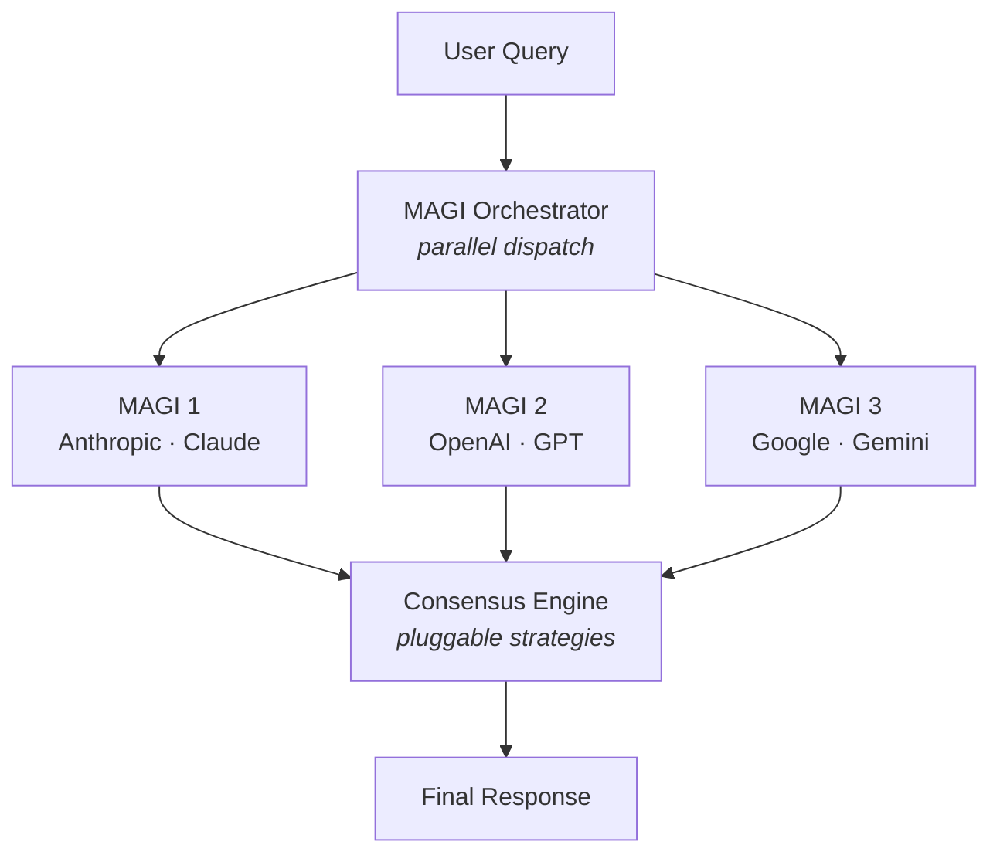

# MAGI

🔺🔻🔺

[](https://github.com/retrobit/magi/actions/workflows/ci.yml)
[](LICENSE)
[](https://www.typescriptlang.org)
[](https://kit.svelte.dev)

**Three AI models. One consensus.**

<p align="center">
  <a href="docs/media/magi-demo.mp4">
    
  </a>
</p>

MAGI sends your question to three frontier models from different providers in parallel, then reconciles their answers into one — by synthesis, structured voting, or a multi-round debate you can watch unfold. Inspired by the MAGI system (IYKYK): three independent supercomputers that deliberate to reach consensus.

## 🤔 Why three?

Any single LLM can hallucinate, hedge, or miss context. Querying three models from different providers and reconciling their answers buys you:

- **Higher confidence** — where all three agree, the answer is likely reliable.
- **Broader coverage** — different training data and reasoning patterns; one model's blind spot is often another's strength.
- **Built-in fact-checking** — disagreement surfaces uncertainty a single model would gloss over silently.
- **Provider independence** — if one provider has an outage, the other two still answer.

## ⚡ How it works



1. **Parallel dispatch** — the query streams to all three models at once, so total latency tracks the slowest model, not the sum.
2. **Independent answers** — each model responds without seeing the others, then a consensus strategy reconciles them (streaming live).
3. **Resilient** — if one or two models fail, MAGI proceeds on what it has and flags the partial result.
4. **Multi-turn** — follow-ups carry context: each node replays only its _own_ prior turns, and the consensus builds on prior consensuses. Anthropic prompt-cache breakpoints keep replayed threads cheap on every follow-up.

## 🧠 Consensus strategies

The consensus engine is pluggable:

- **Synthesis** — one model reads all three answers, reconciles agreements and disagreements, and writes a single unified response. The synthesizer seat is configurable (`consensusNode`, default `MAGI_1`).
- **Structured Voting** — each node scores its peers' answers (anonymized as Candidate A/B) from 0–10; the highest aggregate wins and is shown **verbatim** under a tally table. No extra model call beyond the three jurors, and it works on every tier (lenient score parsing, no structured-output requirement).
- **Multi-Round Debate** — each node stakes out a position, then reads anonymized peers and revises across 2–5 rounds (default 3) before a final synthesis. Stops early on convergence; each round is shown per node.
- **None** — skip consensus entirely and compare the three raw answers side by side.

## ✨ Features

- **Multi-turn conversations** — per-node transcripts, persisted per tier in `localStorage`; each node replays only its own thread.
- **Live streaming UI** — answers and consensus stream token-by-token, with a "N / 3 responded" progress count and an auto-layout that follows the run (nodes → balanced → consensus).
- **Token & cost awareness** — per-node and cumulative token counts, per-model context-window gauges, prompt-cache hits, and a per-provider daily spend readout.
- **Resilient by design** — pre-flight model health checks, partial-consensus fallback, and per-node retry that re-runs one node without re-billing the others.
- **Editable temperaments** — give each MAGI a dispositional lens, or write your own persona (see **Temperaments** below).
- **Deliberation controls** — Opinionated and Collaborative modes, a 2–5 round debate ceiling, and seeded per-turn peer-order shuffling to wash out position bias.
- **Polish** — dark/light theming with five palettes and reduced-motion modes, syntax-highlighted markdown, a filterable run-history panel with JSON export, and an animated ASCII intro.

## 🎭 Temperaments

Each MAGI can answer through an optional **temperament** — a dispositional lens injected as a system prompt:

| Node   | Temperament      | Guiding question                 |
| ------ | ---------------- | -------------------------------- |
| MAGI 1 | 🧊 Rationalist   | "What do the facts say?"         |
| MAGI 2 | 🛡️ Caretaker     | "Who does this affect, and how?" |
| MAGI 3 | 🔥 Individualist | "What feels true?"               |

Temperaments are **off by default** (toggle with 🧠, or `temperaments: true` in the API). Each seat's **name and persona are editable** via the ✏️ editor — rename it, rewrite the persona, or reset to the built-in default; edits persist (sparsely) in `localStorage` and are validated server-side.

When enabled, two consensus controls appear (both **synthesis-only**, off by default): **Consensus Temperament** gives the synthesizer its own lens, and **Temperament Awareness** tells it the actual lens each node used this turn — its real label and persona — so it can surface _why_ answers diverge without guessing.

> For direct-API models, temperaments are sent as a native `system` message; for OpenRouter they're prepended to the prompt, since free-tier models don't reliably support the `system` role.

## 🎚️ Model tiers

Pick a tier to trade quality against cost:

| Tier         | Anthropic         | OpenAI       | Google                |
| ------------ | ----------------- | ------------ | --------------------- |
| **Frontier** | Claude Opus 4.7   | GPT-5.5      | Gemini 2.5 Pro        |
| **Balanced** | Claude Sonnet 4.6 | GPT-5.4      | Gemini 3.5 Flash      |
| **Budget**   | Claude Haiku 4.5  | GPT-5.4 Mini | Gemini 3.1 Flash Lite |
| **Free**     | \*                | \*           | \*                    |

> The **Free** tier routes all three nodes through [OpenRouter](https://openrouter.ai), fetching the currently-live model list dynamically and auto-selecting three from different providers. Set `OPENROUTER_API_KEY` to enable it.

## 🚀 Quick start

```bash
bun install
cp .env.local.example .env.local   # then add your keys
bun run dev
```

You'll need API keys from [Anthropic](https://console.anthropic.com), [OpenAI](https://platform.openai.com), and [Google AI Studio](https://aistudio.google.com) for the paid tiers, and/or [OpenRouter](https://openrouter.ai/keys) for the free tier.

| Variable                       | Required   | Description                          |
| ------------------------------ | ---------- | ------------------------------------ |
| `ANTHROPIC_API_KEY`            | Paid tiers | Claude models                        |
| `OPENAI_API_KEY`               | Paid tiers | GPT models                           |
| `GOOGLE_GENERATIVE_AI_API_KEY` | Paid tiers | Gemini models                        |
| `OPENROUTER_API_KEY`           | Free tier  | OpenRouter models                    |
| `MAGI_API_KEY`                 | No         | Require Bearer-token auth on the API |

<details>
<summary>Optional environment variables (budget readout, OpenRouter attribution, logging)</summary>

| Variable                   | Description                                                                                                                                                                                                                 |
| -------------------------- | --------------------------------------------------------------------------------------------------------------------------------------------------------------------------------------------------------------------------- |
| `ANTHROPIC_ADMIN_KEY`      | Anthropic org admin key (`sk-ant-admin-…`). Enables the Budget readout via `/v1/organizations/cost_report`. Unavailable for individual accounts; falls back to `ANTHROPIC_API_KEY` (which the cost API rejects with a 401). |
| `OPENAI_ADMIN_KEY`         | OpenAI org admin key (`sk-admin-…`). Enables the Budget readout via `/v1/organization/costs`.                                                                                                                               |
| `ANTHROPIC_MONTHLY_BUDGET` | USD decimal (e.g. `50`). Optional bar denominator for the Anthropic Budget row — the API exposes no hard per-key limit.                                                                                                     |
| `OPENAI_MONTHLY_BUDGET`    | Same, for OpenAI.                                                                                                                                                                                                           |
| `OPENROUTER_REFERER`       | Overrides the `HTTP-Referer` sent to OpenRouter. Defaults to this repo; set your deployment URL on a fork.                                                                                                                  |
| `OPENROUTER_TITLE`         | Overrides the `X-Title` sent to OpenRouter. Defaults to `MAGI`.                                                                                                                                                             |
| `MAGI_LOG_LEVEL`           | `debug` \| `info` \| `warn` \| `error`. Defaults to `debug` in dev, `info` in prod.                                                                                                                                         |

</details>

<details>
<summary>Development commands</summary>

```bash
bun run dev          # Start dev server
bun run build        # Production build
bun run preview      # Preview production build
bun run check        # Type-check
bun run test         # Run unit tests
bun run lint         # Check formatting + linting
bun run format       # Auto-format with Prettier
```

In dev, a 🐞 button opens a debug panel that injects synthetic error / context-limit states, plus a **states catalog** enumerating every status, result, and progress indicator. Both are gated by `import.meta.env.DEV` and never ship to production. For manual UI testing, see [TESTING.md](TESTING.md).

</details>

## 🔌 API

MAGI exposes a small SSE-streaming HTTP API. The full machine-readable spec lives in [openapi.yaml](openapi.yaml) (OpenAPI 3.1) — feed it to Swagger UI, Postman, or your codegen of choice.

<details>
<summary>Endpoints, request/response shapes, SSE events, and a client example</summary>

### `GET /api/magi/models`

Available models for a tier (paid: static registry; free: live from OpenRouter).

| Param  | Required | Values                                   |
| ------ | -------- | ---------------------------------------- |
| `tier` | Yes      | `frontier`, `balanced`, `budget`, `free` |

```json
{
	"models": [
		{
			"id": "qwen/qwen3-coder:free",
			"gateway": "openrouter",
			"provider": "qwen",
			"displayName": "Qwen3 Coder",
			"contextLength": 262144
		}
	]
}
```

### `GET /api/magi/budget`

Each paid provider's current spend and remaining credit. OpenRouter is live; others degrade gracefully without admin credentials. `?force=1` bypasses the 60s server cache. Same `Authorization` header as `POST /api/magi` when `MAGI_API_KEY` is set.

```json
{
	"providers": [
		{ "provider": "openrouter", "status": "ok", "usage": 7.2, "limit": 10, "remaining": 2.8 },
		{
			"provider": "anthropic",
			"status": "unavailable",
			"reason": "ANTHROPIC_ADMIN_KEY not configured"
		}
	]
}
```

### `POST /api/magi`

Streams results via Server-Sent Events.

**Headers:** `Content-Type: application/json` (required), `Authorization: Bearer <MAGI_API_KEY>` (only if the key is set).

**Request body:**

```json
{
	"query": "Your question here",
	"tier": "free",
	"strategy": "synthesis",
	"consensusNode": "MAGI_1",
	"assignments": [
		{
			"node": "MAGI_1",
			"gateway": "openrouter",
			"provider": "qwen",
			"modelId": "qwen/qwen3-coder:free"
		},
		{
			"node": "MAGI_2",
			"gateway": "openrouter",
			"provider": "nvidia",
			"modelId": "nvidia/nemotron-3-super-120b-a12b:free"
		},
		{
			"node": "MAGI_3",
			"gateway": "openrouter",
			"provider": "meta-llama",
			"modelId": "meta-llama/llama-3.3-70b-instruct:free"
		}
	]
}
```

| Field                  | Type    | Required | Notes                                                                                             |
| ---------------------- | ------- | -------- | ------------------------------------------------------------------------------------------------- |
| `query`                | string  | Yes      | 1–10,000 characters                                                                               |
| `tier`                 | string  | Yes      | `frontier`, `balanced`, `budget`, `free`                                                          |
| `strategy`             | string  | Yes      | `none`, `synthesis`, `voting`, or `debate`                                                        |
| `consensusNode`        | string  | No       | `MAGI_1` (default), `MAGI_2`, or `MAGI_3`                                                         |
| `assignments`          | array   | No       | Tuple of 3 `NodeAssignment` objects; omit to use the tier preset                                  |
| `temperaments`         | boolean | No       | Enable dispositional temperaments. Default `false`                                                |
| `consensusTemperament` | boolean | No       | Give the synthesizer the `consensusNode`'s lens. Default `false`                                  |
| `temperamentAwareness` | boolean | No       | Tell the synthesizer the actual lens each node used (real label + persona). Default `false`       |
| `genericLabels`        | boolean | No       | Use MAGI 1/2/3 instead of proper names in consensus prompts. Default `true`                       |
| `history`              | array   | No       | Prior turns for context: `{ query, nodeResponses: [{ node, text }], consensus }`. Max 50          |
| `debateRounds`         | number  | No       | Debate round ceiling, 2–5 (clamped). Default 3                                                    |
| `opinionated`          | boolean | No       | Push each model to commit to one answer on open-ended questions (all strategies). Default `false` |
| `collaborative`        | boolean | No       | Push debaters toward convergence (debate only). Default `false`                                   |
| `forceRetry`           | boolean | No       | Bypass and clear the unhealthy-model cache for a real re-call                                     |
| `retryNodes`           | array   | No       | Per-node retry: restrict phase-1 dispatch to these nodes (max 3)                                  |
| `priorResponses`       | array   | No       | Per-node retry: already-good answers for nodes not retried — `[{ node, text }]`, max 3            |

**SSE events:**

| Event                | Payload                                                  | Description                       |
| -------------------- | -------------------------------------------------------- | --------------------------------- |
| `config`             | `NodeAssignment[]`                                       | Node-to-model assignment mapping  |
| `model-chunk`        | `{ node, text }`                                         | Streaming text delta from a node  |
| `model-response`     | `{ node, gateway, provider, text }`                      | A node's complete response        |
| `model-error`        | `{ node, gateway, provider, error }`                     | A node failure                    |
| `model-usage`        | `{ node, inputTokens, outputTokens, cachedInputTokens }` | Token usage for a completed node  |
| `partial-consensus`  | `{ responded, total }`                                   | Warning: not all models responded |
| `consensus-chunk`    | `{ text }`                                               | Streaming consensus text delta    |
| `consensus-complete` | `{ text }`                                               | Full consensus text               |
| `consensus-usage`    | `{ inputTokens, outputTokens, cachedInputTokens }`       | Token usage for the consensus     |
| `error`              | `{ message }`                                            | Fatal error                       |

**Rate limiting:** 10 req/min per IP (in-memory; configure a trusted proxy / `ADDRESS_HEADER` so the server sees real client IPs). **Errors:** `400` bad request · `401` bad/missing key · `415` wrong Content-Type · `429` rate limited. Frame the SSE stream by splitting on `\n\n` and reading the `event:` / `data:` lines.

</details>

## 🧰 Stack & security

**Stack:** Bun · TypeScript · SvelteKit · [Vercel AI SDK](https://sdk.vercel.ai) · Tailwind CSS · Zod. Display font [Michroma](https://fonts.google.com/specimen/Michroma), body font [Atkinson Hyperlegible](https://fonts.google.com/specimen/Atkinson+Hyperlegible).

**Security:** optional Bearer-token auth (`MAGI_API_KEY`) with timing-safe comparison; SvelteKit CSRF protection when unset; per-IP rate limiting; Zod validation on every request; `Content-Type` enforcement; client disconnects abort in-flight LLM calls; server errors never leak internals to the client.

## ☁️ Deployment

Built with [`adapter-auto`](https://svelte.dev/docs/kit/adapter-auto) — works out of the box on [Vercel](https://vercel.com), [Netlify](https://netlify.com), and [Cloudflare Pages](https://pages.cloudflare.com); swap the adapter in `svelte.config.js` for anything else. Run `bun run build`, set your environment variables, and ship.

> The in-memory rate limiter resets on deploy/restart — for production at scale, back it with Redis. Request logs are structured (`key=value` in dev, JSON per line in prod) for per-model latency and token metrics.

## 🗺️ Roadmap & license

Planned work lives in [ROADMAP.md](ROADMAP.md). Licensed under [MIT](LICENSE).
